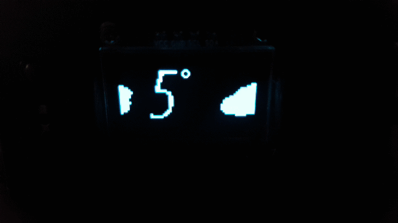

# esp8266_ir_proxy_oled_weather

Listen to an IR signal from a remote, and convert it to another IR signal.

I.e. control your generic IR remote speakers with a Samsung remote.

On top of this it integrates an OLED display for:
- showing the current volume while receiving commands
- after a short interval, display a "weather screen saver" that scrolls the current temperature

Define the following in a secrets.h file:

```
// WiFi credentials
const char* WIFI_SSID = "";
const char* WIFI_PWD = "";

// OpenWeatherMap Settings
// Sign up here to get an API key:
// https://docs.thingpulse.com/how-tos/openweathermap-key/
String OPEN_WEATHER_MAP_APP_ID = "";

/*
Go to https://openweathermap.org/find?q= and search for a location. Go through the
result set and select the entry closest to the actual location you want to display 
data for. It'll be a URL like https://openweathermap.org/city/2657896. The number
at the end is what you assign to the constant below.
 */
String OPEN_WEATHER_MAP_LOCATION_ID = "";
```


